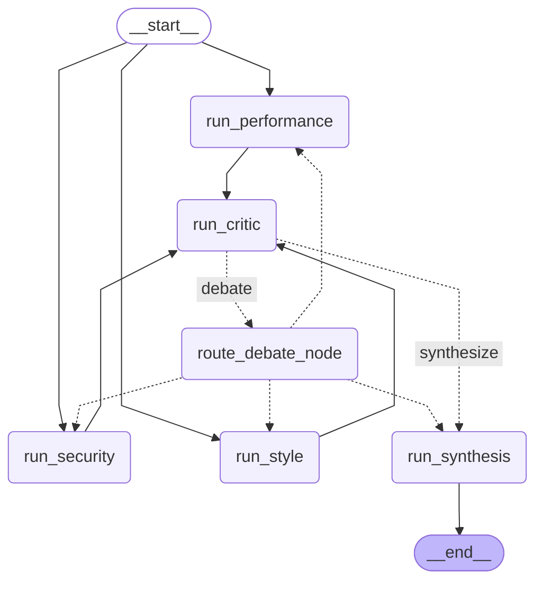

# Projet 6 — Système multi-agents collaboratifs : revue de code

Système de revue de code automatisée par plusieurs agents IA spécialisés qui collaborent, se contestent et convergent vers un rapport final.

## Architecture

```
code soumis
     │
  Orchestrateur (LangGraph)
     │
     ├──► Agent Sécurité     (vulnérabilités)
     ├──► Agent Performance   (bottlenecks)
     └──► Agent Style         (PEP8, lisibilité)
               │
          Agent Critique      (confronte les analyses, détecte les contradictions)
               │         ▲
               │         │ révisions si consensus insuffisant
               ▼         │
          Agent Synthèse ────► rapport final
```

### Graphe LangGraph


> Le graphe est généré via :
> ```bash
> python -c "from graph import review_graph; print(review_graph.get_graph().draw_mermaid())"
> ```

### Concepts clés

- **Graphe de graphes** — chaque agent est un subgraph LangGraph compilé indépendamment
- **État partagé / privé** — `ReviewState` visible par tous, `AgentState` interne à chaque agent
- **Communication inter-agents** — le Critique lit les outputs des trois agents et émet un `CriticVerdict`
- **Débat contrôlé** — cycle de révision piloté par le score de consensus, plafonné par `max_debate_rounds`
- **Fan-out sélectif** — seuls les agents jugés insuffisants sont relancés, pas tous

## Prérequis

- Python 3.11+
- [Ollama](https://ollama.com) installé et en cours d'exécution
- Modèles téléchargés :

```bash
ollama pull qwen2.5-coder:7b
ollama pull llama3.1:8b
```

## Installation

```bash
cd projet6_multi_agent_review
pip install -r requirements.txt
```

## Utilisation

```bash
# Analyse avec streaming temps réel
python main.py mon_fichier.py

# Avec sauvegarde du rapport
python main.py mon_fichier.py --output rapport.md

# Sans streaming
python main.py mon_fichier.py --no-stream
```

### Exemple de sortie

```
📂 Fichier : auth.py
🤖 Modèle code         : qwen2.5-coder:7b
🤖 Modèle raisonnement : llama3.1:8b
🔁 Tours max           : 2
🎯 Seuil consensus     : 0.7

━━━ Démarrage de la revue de code ━━━

  ✓ 🔐 Agent Sécurité     — sévérité 10/10
  ✓ ⚡ Agent Performance  — sévérité 10/10
  ✓ 🎨 Agent Style        — sévérité 10/10
  ✓ 🔍 Agent Critique     — consensus 0.6 | révisions : security, performance
  ✓ 🔀 Routage débat
  ✓ 🔐 Agent Sécurité     — sévérité 10/10 (révisé)
  ✓ ⚡ Agent Performance  — sévérité 10/10 (révisé)
  ✓ 🔍 Agent Critique     — consensus 0.7 | révisions : aucune
  ✓ 📝 Agent Synthèse     — 31 lignes

━━━ Revue terminée ━━━
🔁 Tours de débat effectués : 2

```

## Structure du projet

```
projet6_multi_agent_review/
├── state.py              # États : ReviewState, AgentState, AgentOutput, CriticVerdict
├── config.py             # Configuration centralisée (modèles, seuils, paramètres) + Langfuse
├── graph.py              # Orchestrateur : assemblage du graphe principal + should_debate
├── main.py               # CLI, streaming, rapport final
├── prompt_loader.py      # Chargement et cache des prompts YAML
├── requirements.txt
├── .env.example          # Template des variables d'environnement
├── prompts/
│   ├── security.yaml     # Prompt système + utilisateur de l'agent Sécurité
│   ├── performance.yaml  # Prompt système + utilisateur de l'agent Performance
│   ├── style.yaml        # Prompt système + utilisateur de l'agent Style
│   ├── critic.yaml       # Prompt système + utilisateur de l'agent Critique
│   └── synthesis.yaml    # Prompt système + utilisateur de l'agent Synthèse
├── agents/
│   ├── __init__.py
│   ├── security.py       # Subgraph : détection de vulnérabilités
│   ├── performance.py    # Subgraph : détection de bottlenecks
│   ├── style.py          # Subgraph : PEP8 et lisibilité
│   ├── critic.py         # Subgraph : confrontation des analyses + verdict JSON
│   └── synthesis.py      # Subgraph : rapport final consolidé
└── tests/
    ├── __init__.py
    ├── test_imports.py
    ├── test_security.py
    ├── test_agents.py
    ├── test_critic.py
    └── test_pipeline.py
```

## Configuration

Tous les paramètres sont centralisés dans `config.py` :

| Paramètre | Défaut | Description |
|---|---|---|
| `coder_model` | `qwen2.5-coder:7b` | Modèle pour les agents spécialisés |
| `reasoning_model` | `llama3.1:8b` | Modèle pour le Critique et la Synthèse |
| `temperature` | `0.2` | Faible pour des analyses stables |
| `max_debate_rounds` | `2` | Nombre maximum de tours de révision |
| `consensus_threshold` | `0.7` | Score minimum pour passer à la synthèse |

## Répartition des modèles

| Agent | Modèle | Justification |
|---|---|---|
| Sécurité | `qwen2.5-coder:7b` | Analyse de code précise |
| Performance | `qwen2.5-coder:7b` | Analyse de code précise |
| Style | `qwen2.5-coder:7b` | Analyse de code précise |
| Critique | `llama3.1:8b` | Méta-raisonnement sur les analyses |
| Synthèse | `llama3.1:8b` | Consolidation en langage naturel |


## Lancer les tests

Depuis projet6_multi_agent_review/

```
python -m tests.test_imports
python -m tests.test_security
python -m tests.test_agents
python -m tests.test_critic
python -m tests.test_pipeline
```

## Observabilité (optionnel)

Les traces LLM sont envoyées à Langfuse si les variables d'environnement sont configurées.
Copie `.env.example` vers `.env` et renseigne tes clés :
```bash
cp .env.example .env
```

Sans `.env`, le système fonctionne normalement sans tracing.

Voir [langfuse-selfhosted](https://github.com/k-hamza/langfuse-selfhosted) pour
l'installation de l'instance locale.

## Contexte pédagogique

Ce projet fait partie d'une série de six projets progressifs sur le développement d'agents IA :

| Projet | Thème | Concepts clés |
|---|---|---|
| P1 | Agent RAG local | Pipeline RAG, ChromaDB, retrieval chain |
| P2 | Agent avec outils | ReAct, AgentExecutor, mémoire conversationnelle |
| P3 | Agent de recherche | StateGraph, human-in-the-loop, checkpointing |
| P4 | Automatisation de code | Subgraphs, boucle de correction, exécution sécurisée |
| P5 | Multi-fichiers parallèles | Send API, fan-out, reducers, map-reduce |
| **P6** | **Multi-agents collaboratifs** | **État partagé/privé, débat entre agents, fan-out sélectif** |

## Limitations connues

- Ollama ne parallélise pas les requêtes sur un seul GPU — les agents s'exécutent séquentiellement en pratique malgré le fan-out
- Le parsing des findings est basique (`split("\n")`) — un format JSON structuré améliorerait la précision (prévu en P7)
- Le streaming relance le graphe une seconde fois pour récupérer l'état final proprement
- `consensus_score` est une estimation subjective du LLM — utilisé comme confirmation, pas comme seule source de vérité
